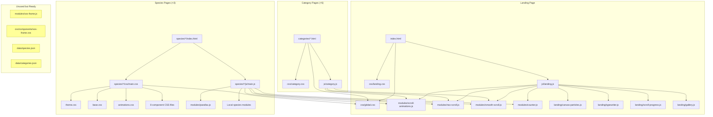

# BEASTIQUE — Comprehensive Project Audit

**Auditor:** Antigravity (AI)
**Date:** April 25, 2026
**Scope:** Full architectural review — scope, connectivity, asset sizing, and web-readiness

> **⚠ Historical (April 2026).** This audit describes the original flat root and
> predates the June 2026 restructure. The paths below (root-level `css/`, `js/`,
> `assets/`, `collections/`, `categories/`, `species/`) have since moved into
> `site/` and `studio/`. For the current layout see
> [PROJECT-TREE.md](PROJECT-TREE.md); for the move rationale and mapping see
> [REORG-AUDIT.md](REORG-AUDIT.md). Retained as a point-in-time snapshot.

---

## 1. Executive Summary

BEASTIQUE is a static, vanilla HTML/CSS/JS conservation-art website. It has a **clear, intentional architecture** with three page tiers (Landing → Category → Species), shared JS/CSS modules, structured JSON data, and a reusable species template system. The code quality is high — modular, well-documented, and accessibility-conscious.

**The critical problem is asset weight.** The project contains **hundreds of megabytes of unoptimized images** (many 2-6 MB PNGs, several 20-190 MB files) that would make this site completely unusable in a browser without aggressive optimization. The code itself is web-ready; the assets are not.

---

## 2. Site Architecture — The Three Tiers

```
┌─────────────────────────────────┐
│        LANDING PAGE             │
│        index.html               │
│   css/global.css + landing.css  │
│   js/landing.js                 │
│   (Hero, Gallery, Categories,   │
│    Mission, Stats, Contact)     │
└────────┬───────────┬────────────┘
         │           │
    ┌────▼────┐ ┌────▼────┐
    │CATEGORY │ │CATEGORY │ ... × 5
    │ PAGES   │ │ PAGES   │
    │aquatic  │ │avian    │
    │insecta  │ │mammalian│
    │reptilian│ │         │
    └────┬────┘ └────┬────┘
         │           │
    ┌────▼────┐ ┌────▼────┐
    │ SPECIES │ │ SPECIES │
    │  PAGES  │ │  PAGES  │
    │(3 built)│ │(template│
    │         │ │  ready) │
    └─────────┘ └─────────┘
```

### Tier 1: Landing Page (`index.html`)
- **668 lines**, well-structured with 12 distinct sections
- Loads `css/global.css` + `css/landing.css`
- JavaScript entry: `js/landing.js` (ES modules)
- Sections: Nav → Hero → Cost Ticker → Gallery (10 slides) → Beast Cards (5 categories) → Live Showcases → Mission → Numbers → About → Contact → Closing Banner → Footer
- Google Fonts: Playfair Display + Raleway

### Tier 2: Category Pages (`categories/`)
- 5 static HTML files: `aquatic.html`, `avian.html`, `insecta.html`, `mammalian.html`, `reptilian.html`
- Each loads `../css/global.css` + `../css/category.css`
- JavaScript entry: `../js/category.js` (lighter than landing)
- Hardcoded species card grids — **NOT dynamically generated from `data/species.json`**
- Cross-navigation between categories via nav bar
- Breadcrumb navigation: Home / Category

### Tier 3: Species Pages (`species/`)
- **3 fully built pages:** Amur Leopard, Beluga Sturgeon, Kākāpō
- **1 template:** `_template/` with guide (`SPECIES-GUIDE.md`)
- **1 incomplete:** `butterfly/` (only has `assets/` and `docs/`, no HTML/CSS/JS)
- Each species is a self-contained micro-site with its own CSS architecture and JS modules
- Breadcrumb: Home / Category / Species

---

## 3. CSS Architecture

### Layered System
```
css/global.css          ← Shared foundation (reset, tokens, utilities, animations)
css/landing.css         ← Landing page specific (~40KB)
css/category.css        ← Category page specific (~9KB)
css/components/
  └── sos-frame.css     ← Reusable SOS frame component (~9KB)

species/{slug}/css/
  ├── main.css          ← @import orchestrator
  ├── theme.css         ← Species color palette + font vars
  ├── base.css          ← Body/background referencing theme
  ├── animations.css    ← Species-specific keyframes
  └── components/       ← 8 section-specific files
      ├── nav.css
      ├── hero.css
      ├── stats.css
      ├── about.css
      ├── facts.css
      ├── conservation.css
      ├── closing.css
      └── footer.css
```

### Design Tokens (global.css `:root`)
- Spacing scale: `--space-xs` through `--space-xl` (clamp-based)
- Motion: `--ease-out-expo`, `--ease-out-back`, duration tokens
- Layout: `--max-width: 1400px`, `--nav-height: 70px`
- **Note:** Color tokens are NOT in global — each species defines its own palette in `theme.css`

### Methodology
- BEM naming: `block__element--modifier`
- `[data-animate]` pattern for scroll reveals
- `prefers-reduced-motion` support ✅
- Custom scrollbar styling
- Skip link + `.sr-only` accessibility utilities
- **@import chains in species `main.css`** — each species CSS entry file uses `@import url()` to pull in global + local files

---

## 4. JavaScript Architecture

### Module System
All JS uses **native ES modules** (`type="module"` on script tags, `import`/`export` syntax).

### Shared Modules (`js/modules/`)
| Module | Size | Purpose |
|--------|------|---------|
| `scroll-animations.js` | 1.2 KB | IntersectionObserver-based `[data-animate]` reveals |
| `counter.js` | 1.9 KB | Animated stat counters (scroll-triggered) |
| `nav-scroll.js` | 505 B | Nav background darkens on scroll |
| `smooth-scroll.js` | 664 B | Anchor link smooth scrolling with offset |
| `parallax.js` | 1.1 KB | Hero parallax effect |
| `sos-frame.js` | **34 KB** | SOS Morse code frame system (the big one) |

### Landing-Specific Modules (`js/landing/`)
| Module | Size | Purpose |
|--------|------|---------|
| `canvas-particles.js` | 5.6 KB | Canvas-based metallic particle system |
| `gallery.js` | 4.4 KB | Featured artwork slideshow |
| `scroll-progress.js` | 1 KB | Nav progress bar |
| `typewriter.js` | 2.9 KB | Hero tagline typewriter effect |

### Species-Specific Modules (local to each species)
- **Amur Leopard:** snowflakes.js, rosette-gallery.js, cursor-snow.js
- **Beluga Sturgeon:** particles.js (ocean bubbles)
- **Kākāpō:** fireflies.js, rosette-gallery.js, cursor-glow.js, taxonomy-tree.js (27 KB!)

### Entry Point Pattern (consistent across all pages)
```js
function bootstrap() {
  try {
    // Init modules here
  } catch (err) {
    console.error('[PageName] Init error:', err);
  }
}
if (document.readyState === 'loading') {
  document.addEventListener('DOMContentLoaded', bootstrap);
} else {
  bootstrap();
}
```

### Import Path Convention
Species pages reference shared modules via relative paths:
```js
import { init } from '../../../js/modules/scroll-animations.js';
```

---

## 5. Data Layer

### `data/categories.json` (2.9 KB)
- 5 category objects with: id, name, tagline, description, color palette, heroSpecies, imageDir
- **Used by:** Nothing at runtime. This is reference data — category pages are hardcoded HTML

### `data/species.json` (69.7 KB)
- **220+ species entries**, each with: id, name, scientific_name, category, conservation_status, tagline, thumbnail, page path, `hasPage` boolean
- **Used by:** Nothing at runtime. Category pages are hardcoded HTML, not dynamically generated
- Only 3 species have `hasPage: true` (amur-leopard, beluga-sturgeon + possibly kākāpō)

### `data/color-palettes/`
- Subdirectory for species-specific color palette data (aquatic subdirectory found)

### ⚠️ Disconnection Alert
**The JSON data files exist but are NOT consumed by any JavaScript.** The category pages hardcode every species card. This means:
- Adding a new species requires editing both `species.json` AND the HTML file
- Species counts shown in category headers can drift from actual data
- There is no filtering, sorting, or search functionality

---

## 6. Asset Inventory & Size Analysis

### 🔴 CRITICAL: Files That Will Break a Web Browser

| File | Size | Location |
|------|------|----------|
| `large-cover-splash-banner.png` | **236 MB** | mini-series/_shared/ |
| `BQ-FOLDER-ICON.png` | **191 MB** | assets/logos/ |
| `hero-with-text.png` | **152 MB** | species/amur-leopard/assets/ |
| `philippine-eagle.png` | **146 MB** | assets/images/featured/ |
| `arctic-hare.png` | **148 MB** | assets/custom-designs/mosaics/ |
| `lion-outline-inkscape.png` | **102 MB** | assets/custom-designs/ |
| `index.svg` | **46 MB** | mini-series/_shared/ |
| `bq-lion-hero.png` | **42 MB** | assets/images/landing/ |
| `great-white-shark.png` (gallery) | **34 MB** | assets/homepage-assets/featured-gallery-images/ |

### 🟡 WARNING: Large But Potentially Usable After Optimization

| File/Area | Sizes | Notes |
|-----------|-------|-------|
| Featured images (`assets/images/featured/`) | 2-20 MB PNGs each, 40 files | Serving as landing gallery + beast cards |
| Carousel images (`homepage-assets/carousel-images/`) | 2.7-5.4 MB PNGs each + SVGs | 10 images total |
| Source images (`holding-area/source-images/`) | 1.4-4.9 MB PNGs, 63 files | ~200 MB total, not directly referenced |
| Species fact images | Various PNGs | In species/{slug}/assets/images/facts/ |
| Custom SVG designs | 1-16 MB SVGs | In assets/custom-designs/ |
| Beastique typography SVGs | 354 KB - 5 MB | In homepage-assets/typographical-designs/ |

### 🟢 Reasonable Size Files
| Area | Size Range | Notes |
|------|-----------|-------|
| All JavaScript combined | ~120 KB total | Very lightweight |
| All CSS combined | ~180 KB total | Very manageable |
| SOS frame SVGs | ~19 KB each | Already optimized |
| HTML files | 8-58 KB each | Fine |
| Data JSON | 2.9 KB + 69.7 KB | Fine |
| Logo `bq_logo.png` | 832 KB | Could optimize but usable |

### Summary of Image Weight Problem
- **Total estimated image weight:** 1.5+ GB
- **Web-suitable images:** Less than 5% of total
- **Primary formats:** PNG (lossless, massive), SVG (design source files), some WebP (already optimized)
- **Files already in WebP:** Only ~10 files (`hero-image.webp`, `hero.webp`, `zebu-1.webp`, etc.) — these are already reasonable sizes

---

## 7. What's Connected vs. What's Orphaned

### ✅ Connected & Working (code references valid paths)
- Landing page → all 10 gallery images in `assets/images/featured/`
- Landing page → 5 beast card images (reuse featured images)
- Landing page → `assets/logos/bq_logo.png`
- Landing page → `assets/images/landing/bq-lion-hero.png` (42 MB! ⚠️)
- Landing page → `assets/images/landing/bq-hero-banner.png` (not found in listing — possible missing file)
- Category pages → species card images in `assets/images/{category}/`
- Species pages → local `assets/` directories
- JS module imports → all resolve via relative paths correctly
- CSS @import chains → correctly structured

### ⚠️ Partially Connected
- `data/species.json` — exists, structured, but NOT consumed by any JS
- `data/categories.json` — exists, structured, but NOT consumed by any JS
- SOS Frame module (`js/modules/sos-frame.js` + `css/components/sos-frame.css`) — fully built system, but **no species page currently uses it**
- Mockup page (`mockups/sos-frame-module-test/index.html`) — standalone test page

### ❌ Orphaned / Not Connected
- `assets/custom-designs/` — Design source files (Inkscape SVGs, PNGs), not web-referenced
- `assets/holding-area/` — Staging area with generated SVGs, source images, templates, coordinate data
- `assets/homepage-assets/` — Carousel/gallery/typography images NOT referenced by current index.html
- `assets/prompts/` — AI image generation prompts (reference material, not code)
- `assets/icons/windows-folder-icons/` — OS-level folder customization
- `assets/mini-series/` — 10 editorial episodes with node_modules, research, scripts, articles — completely separate subsystem
- `species/butterfly/` — Incomplete species (only assets + docs, no HTML/CSS/JS)
- `species/assets/svg-icons-elements/` — Shared SVG elements, not referenced
- `tools/` — Python utility scripts (color extraction, image conversion, SVG generation)
- `docs/beastique-dna.md` — Conceptual framework document (24 KB), not web-surfaced

---

## 8. Architecture Strengths

1. **Clean module system** — ES modules with named exports, consistent `init()` pattern, clear separation of shared vs. page-specific code
2. **Species template system** — `_template/` with comprehensive `SPECIES-GUIDE.md` makes adding new species straightforward
3. **BEM CSS methodology** — Consistent, readable, maintainable class naming
4. **Accessibility** — Skip links, `aria-label`, `aria-hidden`, `sr-only`, `prefers-reduced-motion`, keyboard support
5. **Progressive enhancement** — Everything in vanilla HTML/CSS/JS, no build step, no framework dependency
6. **SOS Frame module** — Impressively engineered reusable component (34 KB of JS, 9 KB of CSS) for animated morse code frames
7. **Data layer exists** — `species.json` with 220+ entries provides a solid foundation for future dynamic rendering
8. **Each species is unique** — Custom particle effects (snow, bubbles, fireflies), color palettes, and ambient effects per species

---

## 9. Architecture Weaknesses & Risks

### 🔴 Critical Issues

1. **Asset Size = Site Killer**
   - The landing page hero alone (`bq-lion-hero.png`) is **42 MB**
   - Featured images average 3-6 MB each, and the gallery loads 10 of them
   - Category pages load 30+ species thumbnails at 2-5 MB each
   - **Estimated landing page weight: 100+ MB** — this will not load in any reasonable time

2. **No Build/Optimization Pipeline**
   - No `package.json` at root level (only in mini-series/)
   - No image compression, no WebP conversion, no responsive `<picture>` elements
   - No CSS minification, no JS bundling
   - No `.gitignore` visible — likely pushing hundreds of MB to git

3. **Data Layer is Decorative**
   - `species.json` and `categories.json` are well-structured but not consumed
   - Category pages are manually maintained HTML with hardcoded species cards
   - This will become a maintenance nightmare at scale (220+ species)

### 🟡 Significant Concerns

4. **CSS @import Chains in Species Pages**
   - Species `main.css` uses `@import url()` for 10+ files
   - Each `@import` is a blocking HTTP request — significant render delay
   - Should be consolidated or use a build step

5. **No Responsive Images**
   - No `<picture>` elements, no `srcset`, no `sizes` attributes
   - Same 5 MB PNG loads on mobile as on desktop
   - No art direction for different viewpoints

6. **Missing/Inconsistent Navigation**
   - Landing page nav uses PNG logo (`bq_logo.png`), category/species pages use SVG hexagon
   - No mobile hamburger menu on category or species pages
   - No breadcrumb on landing page

7. **Butterfly Species is Incomplete**
   - Has `assets/` and `docs/` but no HTML, CSS, or JS
   - Referenced in `species.json` but `hasPage` is not set to true

8. **Mini-Series is a Separate Project**
   - Has its own `package.json`, `node_modules`, research documents, article generators
   - Uses `docx` npm package for Word document generation
   - Not integrated into the main site at all — should be separate repo or clearly documented

### 🟡 Minor Concerns

9. **Missing `favicon.ico`** — File exists (38 bytes) but is essentially empty/placeholder
10. **No `<meta og:*>` tags** — No social sharing metadata
11. **Landing page has unclosed `<p>` tag** — Line 72: `<p class="hero__eyebrow">` is never closed before `<h1>`
12. **`robots.txt` is minimal** — Only 37 bytes, likely just a placeholder
13. **Landing CSS is large** — `landing.css` at 40 KB could benefit from splitting into components like species pages do

---

## 10. What Needs Optimization (Assumed Per User)

Given the user's statement that large files "fundamentally won't work for web browser" and "optimization of these files should be assumed," here is the optimization roadmap:

### Image Optimization Priority

| Priority | Action | Impact |
|----------|--------|--------|
| P0 | Convert ALL referenced PNGs to WebP at 80% quality | 80-95% size reduction |
| P0 | Resize hero images to max 1920px wide | 50-80% size reduction |
| P0 | Resize gallery/card thumbnails to max 800px | 60-80% size reduction |
| P1 | Add `<picture>` elements with WebP + PNG fallback | Mobile performance |
| P1 | Add `srcset` with 480/768/1200/1920 breakpoints | Responsive delivery |
| P1 | Lazy load all images below the fold (most already have `loading="lazy"`) | Initial load |
| P2 | Move non-web assets (design sources, Inkscape files) to separate storage | Repo size |
| P2 | Remove/archive `assets/holding-area/source-images/` (200+ MB of source PNGs) | Repo size |

### Expected Impact
- **Before optimization:** Landing page ~100+ MB, category pages ~80+ MB
- **After optimization:** Landing page ~2-4 MB, category pages ~1-3 MB
- **Target load time:** Under 3 seconds on broadband

---

## 11. Directory Tree (with sizes)

```
beastique/                              ROOT
├── index.html                          39.5 KB      Landing page
├── README.md                           14.1 KB      Project overview
├── LICENSE                             35.8 KB
├── favicon.ico                         38 B         ⚠️ Placeholder
├── robots.txt                          37 B         ⚠️ Minimal
├── desktop.ini                         85 B
│
├── css/                                CSS SYSTEM
│   ├── global.css                      4.4 KB       Shared foundation
│   ├── landing.css                     39.6 KB      Landing styles
│   ├── category.css                    8.8 KB       Category styles
│   └── components/
│       └── sos-frame.css               9.5 KB       SOS frame component
│
├── js/                                 JAVASCRIPT SYSTEM
│   ├── landing.js                      6.2 KB       Landing entry
│   ├── category.js                     851 B        Category entry
│   ├── landing/                                     Landing-specific modules
│   │   ├── canvas-particles.js         5.6 KB
│   │   ├── gallery.js                  4.4 KB
│   │   ├── scroll-progress.js          1.0 KB
│   │   └── typewriter.js              2.9 KB
│   └── modules/                                     Shared modules
│       ├── scroll-animations.js        1.2 KB
│       ├── counter.js                  1.9 KB
│       ├── nav-scroll.js               505 B
│       ├── smooth-scroll.js            664 B
│       ├── parallax.js                 1.1 KB
│       └── sos-frame.js               34.3 KB      ← Complex reusable system
│
├── data/                               DATA LAYER
│   ├── categories.json                 2.9 KB       5 categories
│   ├── species.json                    69.7 KB      220+ species
│   └── color-palettes/                              Color scheme data
│
├── categories/                         CATEGORY PAGES
│   ├── aquatic.html                    32.5 KB      34 species cards
│   ├── avian.html                      57.8 KB      66 species cards
│   ├── insecta.html                    31.9 KB
│   ├── mammalian.html                  43.0 KB
│   └── reptilian.html                 35.4 KB
│
├── species/                            SPECIES PAGES
│   ├── _template/                      Template system
│   │   ├── index.html                  12.3 KB
│   │   ├── SPECIES-GUIDE.md            5.2 KB
│   │   ├── css/ (main + theme + base + animations + 8 components)
│   │   └── js/main.js                  1.5 KB
│   ├── amur-leopard/                   ✅ COMPLETE
│   │   ├── index.html                  41.2 KB
│   │   ├── css/ (main + theme + base + animations + 8 components)
│   │   ├── js/ (main.js + 3 modules: snowflakes, rosette-gallery, cursor-snow)
│   │   ├── assets/ (hero, closing, fact images)
│   │   └── docs/ (research, prompts)
│   ├── beluga-sturgeon/                ✅ COMPLETE
│   │   ├── index.html                  31.1 KB
│   │   ├── css/ (main + theme + base + animations + 8 components)
│   │   ├── js/ (main.js + 1 module: particles)
│   │   ├── assets/ (hero, SVG, fact images)
│   │   └── docs/ (research, prompts)
│   ├── kākāpō/                         ✅ COMPLETE
│   │   ├── index.html                  37.8 KB
│   │   ├── css/ (main + theme + base + animations + 9 components)
│   │   ├── js/ (main.js + 4 modules: fireflies, rosette-gallery, cursor-glow, taxonomy-tree)
│   │   ├── assets/ (hero, article, fact images, SVGs)
│   │   └── docs/ (research, prompts)
│   ├── butterfly/                      ❌ INCOMPLETE (assets + docs only)
│   └── assets/svg-icons-elements/      Orphaned shared SVGs
│
├── assets/                             MEDIA ASSETS
│   ├── logos/                          🔴 191 MB PNG, 833 KB usable logo
│   ├── images/
│   │   ├── featured/                   🔴 40 files, many 3-20 MB PNGs (one 146 MB!)
│   │   ├── landing/                    🔴 42 MB hero PNG
│   │   ├── aquatic/                    Category thumbnails
│   │   ├── avian/                      Category thumbnails
│   │   ├── insecta/                    Category thumbnails
│   │   ├── mammalian/                  Category thumbnails
│   │   ├── reptilian/                  Category thumbnails
│   │   └── banners/
│   ├── icons/windows-folder-icons/     OS customization (not web)
│   ├── homepage-assets/
│   │   ├── carousel-images/            10 images (2.7-5.4 MB each)
│   │   ├── featured-gallery-images/    12 images (various, one 34 MB)
│   │   └── typographical-designs/      SVG typography experiments
│   ├── custom-designs/                 🔴 Design source files (100+ MB)
│   │   ├── sos-frames/                 8 SVG frame files (~19 KB each) ✅
│   │   ├── collages/, framed/, hero/   Design exports (PNG + SVG)
│   │   ├── mosaics/                    🔴 148 MB arctic-hare.png
│   │   ├── scripts/                    24 Python generator scripts
│   │   ├── typography/                 Custom font + SVG lettering
│   │   ├── logos/, icons/, geo/        Additional design files
│   │   └── ideas/                      USA map + state animal images
│   ├── holding-area/                   🔴 Staging area (massive data + images)
│   │   ├── source-images/             63 files, ~200 MB total
│   │   ├── generated-svgs/            7 subdirectories of generated patterns
│   │   ├── data/                      520 KB HTML + JSON data files
│   │   └── templates/                 13 SVG templates
│   ├── prompts/                        AI generation prompts (text, not code)
│   └── mini-series/                    🟡 Separate editorial subsystem
│       ├── package.json               Depends on `docx` npm package
│       ├── node_modules/
│       ├── _shared/                   🔴 236 MB banner, 46 MB SVG
│       └── 01-10 episode dirs/        Articles, research, scripts, assets
│
├── mockups/                            TEST PAGES
│   └── sos-frame-module-test/
│       └── index.html                  8.5 KB
│
├── tools/                              UTILITY SCRIPTS
│   ├── combine-swatches.py            7 KB
│   ├── extract-colors.py              20.9 KB
│   └── normalize-sos-frames.py        5.4 KB
│
├── docs/                               DOCUMENTATION
│   └── beastique-dna.md               24 KB        Conceptual framework
│
└── .vscode/                            Editor config
```

---

## 12. Connectivity Map



---

## 13. Recommendations for Next Steps

### Immediate (Before Any Browser Testing)
1. **Image optimization pipeline** — Convert all PNGs to WebP, resize to web dimensions
2. **Remove or relocate non-web assets** — Design source files, holding area, mini-series should not be in the deploy path
3. **Fix the favicon** — Create a proper .ico or .svg favicon

### Short-Term (Architecture Improvements)
4. **Dynamic category pages** — Use `species.json` to render species cards dynamically instead of hardcoding 500+ lines of HTML per category
5. **Consolidate CSS imports** — Species `main.css` should be a single concatenated file or use a build step
6. **Add responsive images** — `<picture>` elements with multiple sizes and WebP format
7. **Consistent navigation** — Unify the logo treatment (PNG vs SVG) and add hamburger menus to all page tiers

### Medium-Term (Scale & Quality)
8. **Connect the SOS frame system** — The 34 KB SOS frame module is fully engineered but unused by any live species page
9. **Build the butterfly species page** — Assets and research exist but no HTML/CSS/JS
10. **Add social metadata** — Open Graph tags, Twitter cards
11. **Performance budget** — Set a target (e.g., < 3 MB initial load) and enforce it

---

*End of audit. Ready to discuss any section in detail.*
