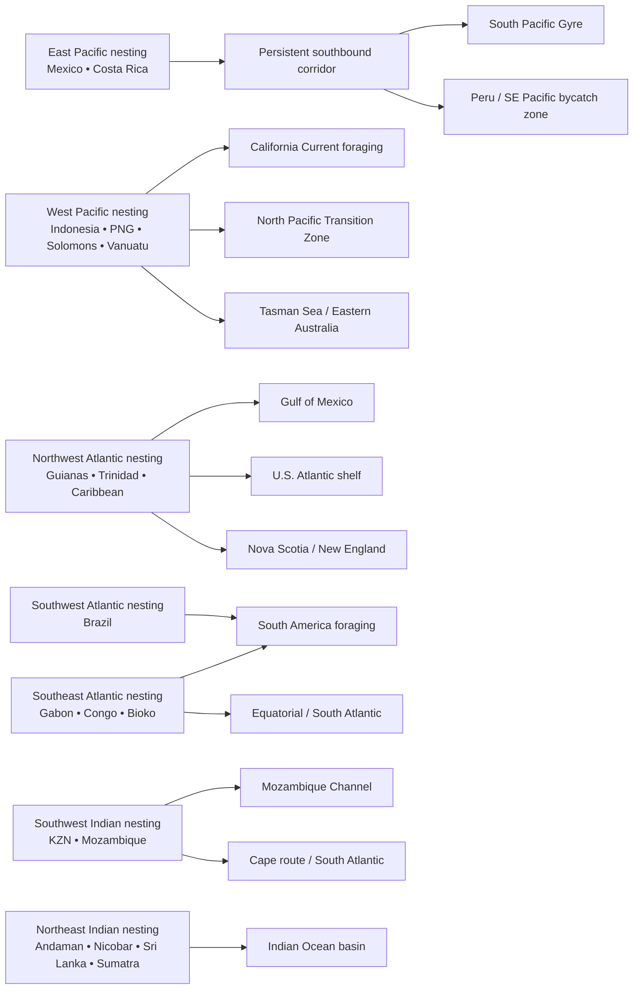
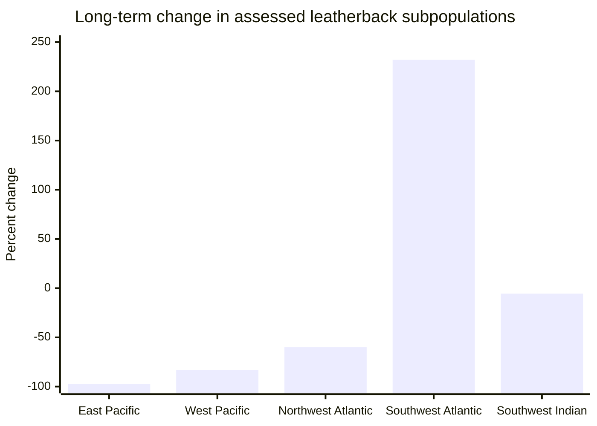

# Leatherback Sea Turtle Populations, Subpopulations, and Geospatial Connectivity

## Executive summary

Leatherback sea turtles are still best understood as a globally distributed species composed of **seven principal regional management units and IUCN subpopulations**: East Pacific, West Pacific, Northwest Atlantic, Southwest Atlantic, Southeast Atlantic, Northeast Indian Ocean, and Southwest Indian Ocean. The global species remains **Vulnerable**, but risk is highly uneven. The strongest evidence supports severe endangerment in the **East Pacific**, **West Pacific**, **Southwest Atlantic**, and **Southwest Indian Ocean**, while the **Northwest Atlantic** remains the largest Atlantic unit but has been reassessed downward because long-term nesting trends are now negative. The **Southeast Atlantic** and **Northeast Indian Ocean** remain data-deficient in IUCN terms largely because abundance and trend data are incomplete rather than because the populations are secure. citeturn41view0turn20search9turn19search0turn7view0

The clearest quantitative signals are stark. The **East Pacific subpopulation** has declined by **97.4% over three generations** and was estimated by IUCN at **633 mature individuals**, with a projection of near-extirpation by around 2040 absent major bycatch reduction. The **West Pacific** has declined by **more than 80%** since the mid-1980s; the Bird’s Head Peninsula in Papua Barat, Indonesia, now constitutes the last large Pacific nesting concentration, with roughly **489 nesting females estimated in 2011** at that major complex. The **Northwest Atlantic** was reassessed from “Least Concern” to **Endangered** after updated region-wide nesting analyses found an approximately **60% decline**, from about **58,000 nests/year** in the past to about **23,000 nests/year** in recent years. The **Southwest Atlantic** shows a paradoxical pattern: nesting in Brazil increased over recent decades, but the population is still so small that IUCN assessed only **35 mature individuals** and kept the unit **Critically Endangered**. The **Southwest Indian Ocean** remains **Critically Endangered** because it is small and geographically constrained, with an estimated **148 adults** and a slight long-term decline. citeturn24search1turn19search18turn20search0turn19search2turn20search2turn23view2turn21view1turn6search4turn31search3turn6search3turn19search17

Geographically, leatherback conservation turns on a few recurring spatial structures. Major nesting concentrations occur in the **eastern tropical Pacific** of Mexico and Costa Rica; **Bird’s Head, PNG, Solomon Islands, and Vanuatu** in the West Pacific; the **Guianas–Trinidad–Wider Caribbean** in the Northwest Atlantic; **Espírito Santo, Brazil** in the Southwest Atlantic; **Gabon–Congo–Bioko** in the Southeast Atlantic; **Andaman–Nicobar and Sri Lanka**, with emerging evidence from **western Sumatra**, in the Northeast Indian Ocean; and **KwaZulu-Natal–southern Mozambique** in the Southwest Indian Ocean. Telemetry demonstrates basin-scale connectivity from these rookeries to temperate and subpolar foraging grounds, including California and the North Pacific Transition Zone for West Pacific turtles, the South Pacific Gyre and Peru–Chile zone for East Pacific turtles, the U.S. Atlantic shelf, Gulf of Mexico, New England, Nova Scotia, and parts of the Northeast Atlantic for Northwest Atlantic turtles, and South Atlantic feeding zones off South America for Southeast Atlantic and some Southwest Atlantic-linked turtles. citeturn20search7turn14search0turn15search0turn16search0turn16search13turn17search2turn18search10turn25search8turn26view0turn33view0

For GIS work, there is now enough public infrastructure to build a robust analytical map stack. The most useful starting layers are: **IUCN-MTSG RMU shapefiles** via OBIS-SEAMAP; **SWOT global leatherback nesting points** with **988 sites** compiled through 2022; **NOAA leatherback critical habitat shapefiles/KML** for the U.S. Caribbean and U.S. West Coast; **OBIS-SEAMAP telemetry datasets** for several regional projects; the new **Dryad/NCEI Northwest Atlantic telemetry compilation**; and regional acoustic platforms such as **ATN** and **OTN** for emerging fine-scale detections. The main practical limitation is that there is **no single authoritative global shapefile of migration corridors**; those corridors generally must be derived from telemetry tracks or gridded occurrence products using kernel-density, utilization-distribution, Brownian bridge, or state-space approaches. citeturn41view0turn11view1turn8search6turn11view3turn22view0turn33view0turn34search0turn34search5turn36view0turn22view3turn12search0

Across regions, the most spatially concentrated and management-relevant threats are **industrial and artisanal fisheries bycatch**, **nesting-beach erosion and coastal development**, **egg and female harvest at some rookeries**, and **climate impacts on nesting success and habitat suitability**. Bycatch remains the dominant global threat in IUCN and NOAA syntheses, and ocean-basin analyses repeatedly identify cross-jurisdictional hotspots where telemetry-inferred habitat overlaps pelagic fisheries. In the Atlantic, integrated analyses identified **nine high-susceptibility areas** for potential longline bycatch. In the eastern Pacific, long-distance satellite tracking has defined a persistent corridor from Costa Rica into the South Pacific Gyre that directly supports dynamic bycatch tools such as **South Pacific TurtleWatch**. In the Northwest Atlantic, recent tagging has expanded evidence for important marine habitat not only in New England and Nova Scotia, but also along the **Mid-Atlantic and South Atlantic Bights** and the **northeastern Gulf of Mexico**. citeturn29search1turn15search0turn15search3turn16search0turn16search5turn16search13turn19search0turn30search2

The highest-priority conservation opportunities are therefore spatially explicit. They include: protecting the remaining **East Pacific nesting strongholds and migration corridor**; maintaining and expanding protection from **Pacific pelagic and coastal fisheries interactions** for West Pacific and East Pacific units; reversing the new documented decline in the **Northwest Atlantic** by targeting mortality across the Guianas–Trinidad and Atlantic shelf system; keeping long-term protection and telemetry going in **Espírito Santo** despite the recent modest increase; securing the globally important **Gabon/Congo/Bioko** rookery complex and the South Atlantic feeding system; and closing the large monitoring gaps in the **Northeast Indian Ocean**, especially where new genetic work indicates that **Sumatra may constitute a distinct management unit** bridging the Indian and West Pacific lineages. citeturn24search8turn24search10turn20search13turn23view2turn31search3turn30search1turn26view0

## Methods and source basis

This report prioritizes **primary and official sources**: IUCN Red List and IUCN-MTSG materials, NOAA Fisheries and NOAA-affiliated repositories, UNEP/CMS-IOSEA resources, OBIS/OBIS-SEAMAP, NCEI/Data.gov, Dryad, and peer-reviewed literature. The temporal focus is the last roughly **30 years**, but older series are included when they define three-generation trends or long-term nesting trajectories that remain central to status assessment. citeturn41view0turn11view3turn22view1turn37view0turn7view0

For population comparisons, I use the **IUCN/MTSG subpopulation framework** as the default organizing principle because it aligns most directly with current extinction-risk assessments. For management interpretation, I also note relevant **RMU 2.0** updates and, where the evidence supports it, finer management units or operational units from genetics or telemetry. The RMU framework itself is based on nesting sites, genetic stocks, satellite telemetry, and expert biogeographic synthesis, and MTSG now provides downloadable shapefiles via OBIS-SEAMAP. citeturn41view0turn40search0

Population size is reported in whatever metric is best-supported for each unit: **mature individuals**, **nesting females**, **nests per year**, or **recent nest-count averages**. These metrics are not fully interchangeable. Where I compare units, I explicitly label the metric or describe it as an index. That is particularly important because some subpopulations are assessed using mature individuals, while others are better tracked by multi-decadal nest series. citeturn24search1turn23view2turn6search4turn6search3

Geodata recommendations emphasize reproducibility. Public products are distinguished from semi-open or restricted ones, and I note where the best current product is **gridded occurrence** rather than raw tracklines. For example, SWOT nesting points are downloadable after terms acceptance and email verification; NOAA critical habitat is available directly as shapefile/KML; many OBIS-SEAMAP telemetry datasets are delivered as **aggregated 1-degree cells** with dataset-level licenses; the new Northwest Atlantic Dryad dataset provides rounded raw locations; and some NOAA/NCEI collections are cataloged but not fully open at present. citeturn11view2turn11view3turn22view0turn33view0turn36view0turn37view0

## Global population structure and status

### Comparative table of subpopulations

| Subpopulation / RMU | Current IUCN status | Best-supported population index | Recent long-term trend | Genetic / management note | Main nesting regions | Main marine connectivity / foraging areas | Dominant spatial threats | Sources |
|---|---|---:|---|---|---|---|---|---|
| **East Pacific Ocean** | **Critically Endangered** | **633 mature individuals**; projection to ~52 nests/year by 2040 in IUCN scenario | **-97.4% over 3 generations** | Distinct East Pacific stock; Mexico lineage claims were recently challenged as NUMT artifacts rather than a new true lineage | Mexico and Costa Rica; isolated nesting in Panama and Nicaragua | Post-nesting corridor south from Costa Rica across equatorial Pacific into **South Pacific Gyre**; foraging/dispersal off **Peru–South America** | Fisheries bycatch, egg harvest historically, climate-driven embryo/hatchling mortality, coastal impacts | citeturn24search1turn15search0turn19search16turn31search11turn27view0 |
| **West Pacific Ocean** | **Critically Endangered** | Bird’s Head complex ~**489 nesting females** estimated in 2011; Malaysia functionally extirpated | **>80% decline since mid-1980s**; ~**83% decline over 3 generations** in recent status syntheses | Western Pacific rookeries are structured but linked within a broader Pacific unit; West Pacific turtles reaching California are the same macro-unit | Papua Barat/Bird’s Head, PNG, Solomon Islands, Vanuatu; former Malaysia rookery collapsed | Trans-Pacific migration to **California Current** and U.S. West Coast; also **Tasman Sea**, **eastern Australia current**, **South China Sea**, **North Pacific Transition Zone** | Industrial and coastal fisheries bycatch, egg/female harvest, nest predation, beach erosion/inundation, climate stress | citeturn20search0turn20search2turn14search0turn14search1turn19search12 |
| **Northwest Atlantic Ocean** | **Endangered** | ~**23,000 nests/year** recent vs ~**58,000 nests/year** in past; earlier estimate **4,800–11,000 nesting females** in 2004–2005 | **~60% decline** in updated IUCN analysis; recent regional trend negative | Large Atlantic unit spanning the Wider Caribbean to temperate North Atlantic; strong stock complexity within Atlantic, but operationally one NWA subpopulation | Guianas, Trinidad, Costa Rica/Panama, Lesser Antilles, Florida, USVI and other Caribbean sites | U.S. Atlantic shelf, **Mid-Atlantic and South Atlantic Bights**, **Southern New England**, **Nova Scotia**, **Gulf of Mexico**, some Northeast Atlantic use | Fisheries bycatch, beach erosion/habitat loss, offshore development overlap, changing life-history parameters | citeturn23view2turn21view0turn16search0turn16search5turn16search13turn36view0 |
| **Southwest Atlantic Ocean** | **Critically Endangered** | **35 mature individuals**; 1.2–18.4 females nesting annually in historical Brazil series | Long-term nesting trend **increasing**; 30-year series rose from mean **25.6** to **89.8** nests, but absolute population remains tiny | Brazil nesting unit is demographically and management-wise distinct; South Atlantic mixed-stock work shows strong connection to African-origin turtles in shared foraging grounds | **Espírito Santo, Brazil** | South Atlantic dispersal; overlap with foraging/stranding zone in **Uruguay–Argentina** and broader SW Atlantic | Small population size, fisheries bycatch, climate change, pollution, coastal development, artificial light | citeturn6search4turn31search3turn31search6turn18search10turn18search0 |
| **Southeast Atlantic Ocean** | **Data Deficient** | **15,730–41,373 breeding females** estimated from a few major African rookeries; Gabon dominates Atlantic nesting abundance | Trend unresolved because key Gabon series remain incomplete for IUCN assessment | Atlantic genetics show strong differentiation among rookeries, and mixed-stock analyses indicate major contribution of West African rookeries to South American foraging grounds | **Gabon**, Republic of Congo, Bioko (Equatorial Guinea), Ghana/West Africa | South Atlantic post-nesting dispersal to **South America**, equatorial and southern Atlantic feeding zones | Bycatch, industrial trawling and longline overlap, offshore oil/gas and coastal infrastructure, harvest in some places | citeturn3search6turn30search2turn17search2turn17search13turn30search3turn30search15 |
| **Northeast Indian Ocean** | **Data Deficient** | Historical estimates are incomplete and inconsistent; key current nesting signal is roughly **1,000 nests/year in Nicobars** and **100–200 on Little Andaman** in recent summaries | Long-term trend unresolved officially; recent field updates suggest **stability in Little Andaman and re-formed Nicobar beaches** after tsunami | Major gap area; recent mtDNA work from **west Sumatra** supports a **distinct management unit** bridging Indian and West Pacific lineages | **Great/Little Nicobar**, **Little Andaman**, Sri Lanka; emerging evidence from **western Sumatra** | Indian Ocean migrations from Little Andaman tracked as far as **Western Australia**, **Mozambique**, and **Madagascar** | Egg depredation/harvest, bycatch, sparse monitoring, post-tsunami habitat dynamics | citeturn7view0turn25search8turn25search10turn26view0turn25search12 |
| **Southwest Indian Ocean** | **Critically Endangered** | **148 adults** estimated; South Africa accounts for >90% of abundance | **-5.6% over 3 generations** | Genetically distinct from all other leatherback subpopulations in IUCN summary; western Indian margin nesting is geographically constricted | **KwaZulu-Natal, South Africa**, and Mozambique | Atlantic side of Cape route to **Mozambique Channel** and wider Indian Ocean; oceanographic tracking shows current-driven wandering | Fisheries bycatch, egg and meat harvest in Mozambique, small population size, narrow nesting range | citeturn6search0turn6search3turn19search17turn33view0 |

### Genetic stock structure and management units

At the highest level, leatherbacks are currently partitioned into seven RMUs/subpopulations in IUCN-MTSG practice, and the RMU 2.0 update reaffirmed that these boundaries are built from **nesting sites, genetic stocks, satellite telemetry, and expert biogeography**. RMU shapefiles are publicly downloadable via OBIS-SEAMAP through the MTSG RMU portal. citeturn41view0

Within the **Atlantic**, the strongest published genetics synthesis used mtDNA plus 17 microsatellite loci from **1,417 individuals** sampled across **nine nesting sites** from the Atlantic and Southwest Indian Ocean. It found substantial differentiation among most rookery pairs and concluded that **all nine nesting colonies should be considered demographically independent populations for conservation**. That is a strong signal against treating Atlantic leatherbacks as a single homogeneous stock. citeturn9view0

For mixed-stock connectivity, recent Atlantic work has sharpened the map further. Genetic stock identification of leatherbacks from **Argentina and Uruguay** assigned about **92%** of sampled turtles to **Ghana and Gabon**, with smaller contributions from the **Northwest Atlantic** and **Southwest Indian Ocean**. That result reinforces the Southeast Atlantic’s importance not only as a nesting region but also as a source for high-latitude South American feeding grounds. citeturn18search0turn17search13

In the **Northeast Indian Ocean**, the most important new finding is from Sumatra. The 2025 Frontiers study reported eight mtDNA haplotypes in west Sumatran nesting turtles, including a novel haplotype, and found that Sumatra contains lineages from both Indian Ocean and West Pacific clades. The authors therefore argued that **Sumatra should be recognized as a distinct management unit**, separate from other Northeast Indian Ocean populations. This has not yet been folded into IUCN Red List structure, so it should be treated as an important emerging refinement rather than a formal replacement of the current RMU schema. citeturn26view0

## Geodata and mapping resources

### Interactive maps and downloadable geodata

The most useful public geodata products for leatherback analyses are summarized below.

| Dataset / portal | What it provides | Format / access | Licensing / restrictions | Why it matters | Sources |
|---|---|---|---|---|---|
| **IUCN-MTSG RMU shapefiles** | Updated RMU 2.0 polygons and supporting metadata | Download via MTSG RMU page and OBIS-SEAMAP | Publicly available per MTSG portal | Baseline polygons for population-level GIS, status summaries, and management-unit mapping | citeturn41view0 |
| **SWOT Global Leatherback Nesting** | **988 nesting sites** worldwide compiled through 2022; metadata on source and abundance class | Interactive map; downloadable through SWOT/OBIS-SEAMAP; ArcGIS-hosted layer advertises CSV, KML, GeoJSON and related services | Requires agreeing to terms; SWOT/OBIS-SEAMAP download workflow uses email verification/passcode | Best available global point layer for nesting sites and coordinates | citeturn11view1turn11view2turn8search6 |
| **NOAA leatherback critical habitat** | U.S. Caribbean and U.S. West Coast critical habitat polygons | Direct **PDF**, **metadata**, **KML/KMZ**, **shapefile**, **web service** | Consult metadata/Federal Register for legal boundaries | Essential for overlaying Pacific and Caribbean management boundaries with telemetry and threat layers | citeturn11view3 |
| **OBIS-SEAMAP / OBIS taxon and project datasets** | Satellite telemetry and occurrence datasets, often gridded by 1-degree cells; multiple leatherback studies | Web map, occurrence downloads, dataset pages, APIs | Dataset-specific Creative Commons licenses | Core source for multi-region movement data and public geospatial occurrence products | citeturn22view1turn32search7 |
| **Dryad Northwest Atlantic dataset** | **82,963** Argos/Fastloc GPS locations from **75** leatherbacks tagged **2017–2024** off the U.S. East Coast | Public CSV + README | Public Dryad dataset; coordinates rounded to 0.1° by design | Best current openly downloadable raw-ish NWA satellite location dataset | citeturn36view0 |
| **NOAA/NCEI North Atlantic sea turtle ecology collection** | Catalog and granule structure for broader North Atlantic leatherback/loggerhead telemetry and model products, 2004–2024 | NCEI/Data.gov landing and granules | Metadata lists **accessLevel: non-public**, though catalog is public and some related subsets are already public elsewhere | Useful for tracking provenance and future expansions of open telemetry | citeturn37view0 |
| **ATN / OTN** | Acoustic and other telemetry infrastructure and data portals | Web portals and node networks | Access varies by contributing project and platform | Best entry points for fine-scale acoustic detections, receiver footprints, and interoperable telemetry | citeturn22view3turn12search0 |

### Regionally important public telemetry datasets

A practical leatherback GIS stack usually needs both global layers and regional movement datasets. High-value public examples include:

- **Peru Leatherback Tracking Project** in OBIS/OBIS-SEAMAP, summarizing telemetry from the Peruvian coast where gillnet interactions are high; the public OBIS product is an aggregated **1-degree-cell** dataset and is released under **CC BY-NC 4.0**. citeturn22view0
- **Leatherback Tracking in South Africa** in OBIS/OBIS-SEAMAP, with **3,630 occurrence records**, **CC BY 4.0**, and movements from KwaZulu-Natal into the Mozambique Channel and Atlantic side of southern Africa. citeturn33view0
- **Gabon 2008–09: Mayumba & Pongara** in OBIS-SEAMAP, a gridded telemetry product for the globally important Gabon rookery. citeturn34search0turn34search2
- **Study of the Biology of Sea Turtles in Brazil through Satellite Telemetry**, a Projeto TAMAR/STAT product in OBIS-SEAMAP that includes leatherback records among other species. citeturn34search1turn34search5
- **Duke North Atlantic Turtle Tracking**, an OBIS-SEAMAP/STAT dataset relevant to along-shelf habitat use and fisheries interaction studies in the western North Atlantic. citeturn35search1turn35search2

### How to obtain a workable leatherback GIS package

For a reproducible project, a good minimal download set is:

1. **RMU polygons** from the IUCN-MTSG RMU portal. citeturn41view0  
2. **SWOT global nesting points** for site coordinates and abundance classes. citeturn11view1turn11view2  
3. **NOAA critical habitat shapefiles/KML** for U.S. Atlantic and Pacific conservation overlays. citeturn11view3  
4. **Regional telemetry layers** from OBIS-SEAMAP and the **Dryad NWA CSV** for movement analyses. citeturn22view0turn33view0turn34search2turn34search5turn36view0  
5. Optional **ATN/OTN acoustic layers** where acoustic detections matter. citeturn22view3turn12search0  

The key caveat is that public telemetry products are often **spatially thinned or aggregated**. If you need corridor-width estimates, utilization distributions, or dynamic overlap metrics, the public grid products are useful for screening, but published raw or lightly processed telemetry datasets are preferable where available. citeturn22view0turn33view0turn36view0

## Connectivity and spatial analysis

### Basin-scale connectivity synthesis

This simplified flowchart captures the recurring connectivity supported by satellite telemetry and genetics. The highest-confidence trans-basin links are: **East Pacific rookeries to the South Pacific Gyre and southeastern Pacific waters**; **West Pacific rookeries to the California Current, North Pacific Transition Zone, and Australasian pelagic systems**; **Northwest Atlantic rookeries to the Atlantic shelf system, Gulf of Mexico, New England, and Nova Scotia**; **Southeast Atlantic rookeries to South American waters**; and **Southwest Indian / Northeast Indian units to broad Indian Ocean pelagic habitats shaped by major current systems**. citeturn15search0turn14search0turn16search0turn16search13turn17search2turn33view0turn25search10

### Trend chart for assessed subpopulations

The chart below uses the best-supported long-term percentage changes available from assessed or recent official sources. Data-deficient units are omitted because current official trend estimates are not robust enough for direct comparison. citeturn24search1turn20search0turn23view2turn6search4turn19search17

The important analytical point is that the **direction of change** and the **absolute size of the unit** do not always align. The Southwest Atlantic illustrates that clearly: it is increasing, yet still critically endangered because the total population is extremely small. Conversely, the Northwest Atlantic remains much larger than the Pacific units, but its recent reassessment shows that abundance decline is now substantial enough to warrant a higher extinction-risk category than previously recognized. citeturn6search4turn31search3turn23view2

### Telemetry and acoustic evidence by region

Satellite telemetry remains the backbone of leatherback corridor mapping. In the **Northwest Atlantic**, the strongest new open data product is the Dryad compilation of **82,963 locations from 75 turtles tagged 2017–2024**, and recent NOAA-linked studies identify not only traditional northern foraging grounds but also prolonged high-use areas along the **Mid-Atlantic and South Atlantic Bights** and the **northeastern Gulf of Mexico**. citeturn36view0turn16search0turn16search5turn16search13

Acoustic telemetry is growing but still geographically patchy. A 2026 study attached **46 acoustic transmitters** to nesting Northwest Atlantic leatherbacks in Costa Rica and Florida between **2019 and 2025**, demonstrating the feasibility of long-term post-nesting monitoring in the Gulf of Mexico and Northwest Atlantic. NOAA’s marine turtle biotelemetry program also reports using **Argos-linked GPS, Argos-only, acoustic transmitters, time-depth recorders, and turtle-borne video systems** in Pacific studies. Operationally, the best portals for acoustic work are **ATN** and **OTN**, but leatherback detections are not yet harmonized into a single global open layer comparable to the nesting or RMU products. citeturn12search2turn12search4turn22view3turn12search0

In the **Pacific**, telemetry has directly informed management. East Pacific tracking documented a **persistent post-nesting migration corridor** shaped by equatorial currents and extending into the South Pacific Gyre, while West Pacific telemetry showed **>10,000 km** migrations from Indonesian rookeries to the U.S. West Coast and other pelagic foraging zones. These track products underlie tools such as **South Pacific TurtleWatch**, which predicts residence time of East Pacific leatherbacks to support bycatch reduction, and complement standing protections such as NOAA’s **Pacific Leatherback Conservation Area** off California–Oregon–Washington. citeturn15search0turn15search3turn14search0turn14search2

## Priority actions and open questions

### Spatial priorities for conservation and research

The most urgent spatial priority is the **East Pacific corridor system**, from Costa Rican and Mexican nesting beaches through the equatorial corridor into the South Pacific Gyre and the Peru–Chile interaction zone. This is the region where the extinction-risk trajectory is clearest, the migratory pathway is unusually persistent, and bycatch reduction is most likely to yield immediate demographic benefit. Existing dynamic tools should be expanded and formally integrated with RFMO and national management. citeturn24search1turn15search0turn15search3turn31search11

The second priority is the **West Pacific–California Current system**. The nesting base has contracted dramatically, now relying heavily on Bird’s Head and a few Melanesian rookeries, while the foraging distribution spans multiple national and high-seas jurisdictions. Continued aerial monitoring, telemetry, and fishery-overlap mapping from Indonesia to the eastern Pacific are justified because the unit is both highly migratory and sharply depressed. citeturn20search2turn14search0turn19search12turn38search16

A third priority is the **Northwest Atlantic shelf and Gulf of Mexico migration complex**. The new Endangered assessment means the management question in this basin is no longer whether the population is large, but whether enough adult and subadult mortality is occurring at sea to reverse decades of protection at nesting beaches. The new telemetry synthesis points strongly to the U.S. shelf, Gulf, and northern shelf-edge system as priority zones for dynamic management, gear mitigation, and cumulative-impact assessment. citeturn23view2turn16search0turn16search5turn16search13turn36view0

For the **Southeast Atlantic**, the priority is to protect the **Gabon–Congo–Bioko** nesting arc and combine that with South Atlantic bycatch assessment. This unit likely forms the principal source of many turtles found in South American feeding grounds, which means nesting protection alone is insufficient. A focused Atlantic-wide bycatch evidence synthesis remains one of the highest-return research gaps. citeturn30search1turn17search13turn29search1

The **Northeast Indian Ocean** should be treated as a major uncertainty hotspot rather than a peripheral unit. Recent work suggests that **Sumatra may be a distinct management unit**, and recent field reports indicate stronger nesting persistence in Andaman–Nicobar than older assessments captured. The priority here is sustained standardized monitoring, coordinated genetics, and telemetry capable of redrawing Indian Ocean management boundaries on contemporary evidence. citeturn26view0turn25search8turn25search10

### Representative conservation status and listings

At the global and multilateral level, leatherbacks are currently **Vulnerable** on the IUCN Red List globally, with multiple subpopulations in higher threat categories. In U.S. law, the species is **Endangered under the ESA**, and NOAA provides critical habitat layers for the U.S. Virgin Islands and U.S. West Coast. NOAA also notes listing under **CITES Appendix I** and **SPAW Annex II**. In Canada, the species has been separated under SARA into **Atlantic** and **Pacific** populations, both listed as **Endangered**, with COSEWIC reaffirming Endangered status for the Pacific population in 2022. These national examples are representative, not exhaustive of all range states. citeturn20search9turn28search2turn11view3turn28search5turn28search6turn28search1

### Caveats and open questions

Several points remain unresolved and matter for any rigorous GIS or status analysis.

First, **not all population estimates use the same currency**. Some are mature individuals, some nesting females, some nests, and some abundance-weighted trend surfaces. Direct arithmetic comparison across units should therefore be avoided. citeturn24search1turn23view2turn6search4turn6search3

Second, **Data Deficient does not mean low concern**. In both the Southeast Atlantic and Northeast Indian Ocean, the limiting factor is incomplete trend information, not evidence of security. Gabon likely anchors the largest Atlantic rookery complex, and Andaman–Nicobar plus Sumatra may represent a more important Indian Ocean system than the official assessments currently capture. citeturn30search2turn3search6turn25search4turn26view0

Third, public geodata are uneven. Some telemetry products are delivered as **1-degree aggregates**, some as rounded occurrence tables, and some only as catalog metadata. That means migration “corridors” in many cases must be interpreted as **modeled utilization zones** rather than authoritative legal boundaries. citeturn22view0turn33view0turn36view0turn37view0

Fourth, the relationship between **RMUs**, **genetic stocks**, and **management units** is still evolving in some regions. The Atlantic likely needs finer operational separation than a simple north/south treatment for some questions, while the Indian Ocean–West Pacific boundary around Sumatra is clearly in flux. citeturn9view0turn17search2turn26view0

Finally, acoustic telemetry for leatherbacks is promising but still immature as a globally standardized evidence stream. It is already useful for regional residence and detection analysis, especially in the Northwest Atlantic and California Current contexts, but it is not yet a substitute for satellite telemetry in ocean-basin corridor mapping. citeturn12search2turn12search4turn22view3